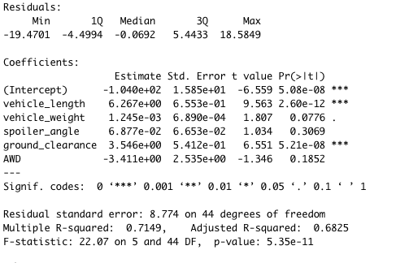
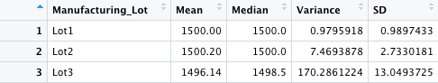
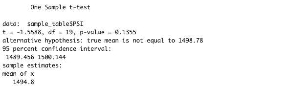
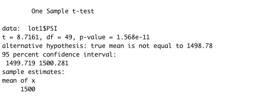
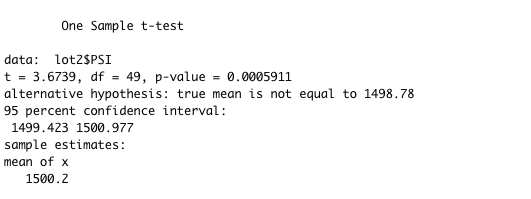
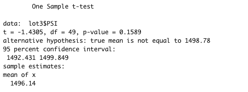

# Mechacar_Statistical_Analysis
## Deliverable 1: Linear Regression to Predict MPG
I used R to create a multiple linear regression of the effect of vehicle length, vehicle weight, spoiler angle, ground clearance, and all wheel drive status to try to predict the MPG that a vehicle would get. Below is the summary of the model:

The null hypothesis is that the selected variables provide a random amount of variance in the mpg values. The alternative hypothesis is that the independent variables do not cause a random amount of variance in the mpg values. 
### Which variables/coefficients provided a non-random amount of variance to the mpg values in the dataset?
As we see in our results table, the vehicle weight, spoiler angle, and all wheel drive status all have p-values that are above our confidence level of 95%. This means that we would fail to reject the null hypothesis that these variables provide a random amount of variance in the MPG. 
The vehicle length and ground clearance both have p-values that are well below the .05 confidence level. This means that we would reject the null hypothesis that these variables cause a random amount of variance in MPG, and therefore cause a non-random amount of variability in MPG. 

### Is the slope of the linear model considered to be zero? Why or why not?
The slope of the linear model is not zero. Each of the variables tested has a coefficient that is non-zero. The vehicle weight has the smallest coefficient (in absolute value) at .001245, so holding all other variables constant, an increase of 1 unit of weight would correlate with an increase of .001245 MPG for a car. While this is small, it is still non-zero. 

### Does this linear model predict mpg of MechaCar prototypes effectively? Why or why not?
Drawing from the Adjusted R-Squared value of .6825 (68%), I can say that 68% of the variation of MPG can be explained by these 5 variables. This information is indicative that this model predicts mpg effectively, however I'd use caution before broadly applying these relationships as R-Squared values are sensitive to overfitting through adding too many variables to a multi-linear regression. I'd want to build a few more models, removing one variable at a time, and see how the R-squared value changes. 

## Summary Statistics on Suspension Coils
Below are the summary statistics for all of the suspension coils:

The design specifications for the Mechacar suspension coils dictates that the variance of the suspension coils must not exceed 100 pounds per square inch. When we consider all three manufacturing lots, it appears that in total these coils pass that test, as the variance is 62.3. However, we must dig further into each manufacturing lots data.

Below are the summary statistics for the suspension coils sorted by the lot that they were manufactured at:

This is exactly why it is important to thoroughly analyze our production data and sort it lot by lot. As we see in the table, Lots 1 and 2 both have a variance of less than 100 pounds per square inch, but Lot 3 has a variance of 170.3, which fails the quality test. In the aggregate, it appeared that all of the suspension coils passed the test, but clearly Lot 3 has some manufacturing failure that is causing a high degree of variability in the PSI of their suspension coils. 

## T-Tests on Suspension Coils

I pulled a random sample of n=20 out of the population of 150 to try and determine if there was a statistically significant difference in the sample mean against the population mean. The results of the t-test are shown below:

As we see here, the t-test returns a p-value of .1355, which is larger than the confidence level of .05. We fail to reject the null hypothesis, so when pulling a random sample of 20 cars from all lots, the sample's mean and population mean are equal.

I also am interested to see how each manufacturing lot performs when compared to the population mean. 

# Lot 1 T-Test
I first compared all 50 observations from Lot 1 to the population mean using a t-test. The results are shown here:

We see here the p-value is much smaller than the confidence level of .05, so we reject the null hypothesis that the true mean of the sample is equal to the population mean. The Lot 1 mean is 1500 which is not equal to the population mean of 1498.78.

# Lot 2 T-Test
I then compared all 50 observations from Lot 2. The results are shown here:

Lot 2's sample had a p-value that also falls in the rejection region at our confidence level. We reject the null hypothesis that the true mean of the sample is equal to population mean.

# Lot 3 T-Test
I then compared all 50 observations from Lot 3. The results are shown here:

## Study Design: MechaCar vs. Competition

When comparing the MechaCar to a competitor, I'd follow the scientific method to determine what questions consumers want answered, a hypothesis, a methodology to statistiscally compare the two companies, and then have actionable data that MechaCar can draw conclusions from.
One question that I would ask is what vehicle specifications are consumers most price-sensitive to? Are consumers willing to pay more money for a sedan with higher horse power, better gas mileage, or better safety rating? In order to answer this question, I'd need to look at a competitors sales data for each vehicle purchased that includes the individual cars specifications. The null hypothesis for this model would be that each of these three selected metrics cause a random variation in the price of the car. The alternative hypothesis would be that one of these metrics causes a nonrandom variation in the sale price. I would first do a correlation analysis to get a general sense of each of these independent variables affects the price of the car on their own. I'd then do a multi-linear regression, and analyze the respective p-values for each of the independent variables. If the p-value is less than my confidence level, I would know that consumer behavior changes depending on the change in each variable. This would also be useful to determine which metrics MechaCar should spend less time on improving. If my statistical tests find that raw horsepower does not have a significant affect on sale price, I would advise MechaCar to invest less in bettering this technology, and look to other places to gain a price advantage over their competitors. I would need sales data, ideally straight from a dealership, to conduct this analysis, but there might be a way to control for resale value decreases, as long as I apply a "resale treatment" correctly to all vehicles sold. 

